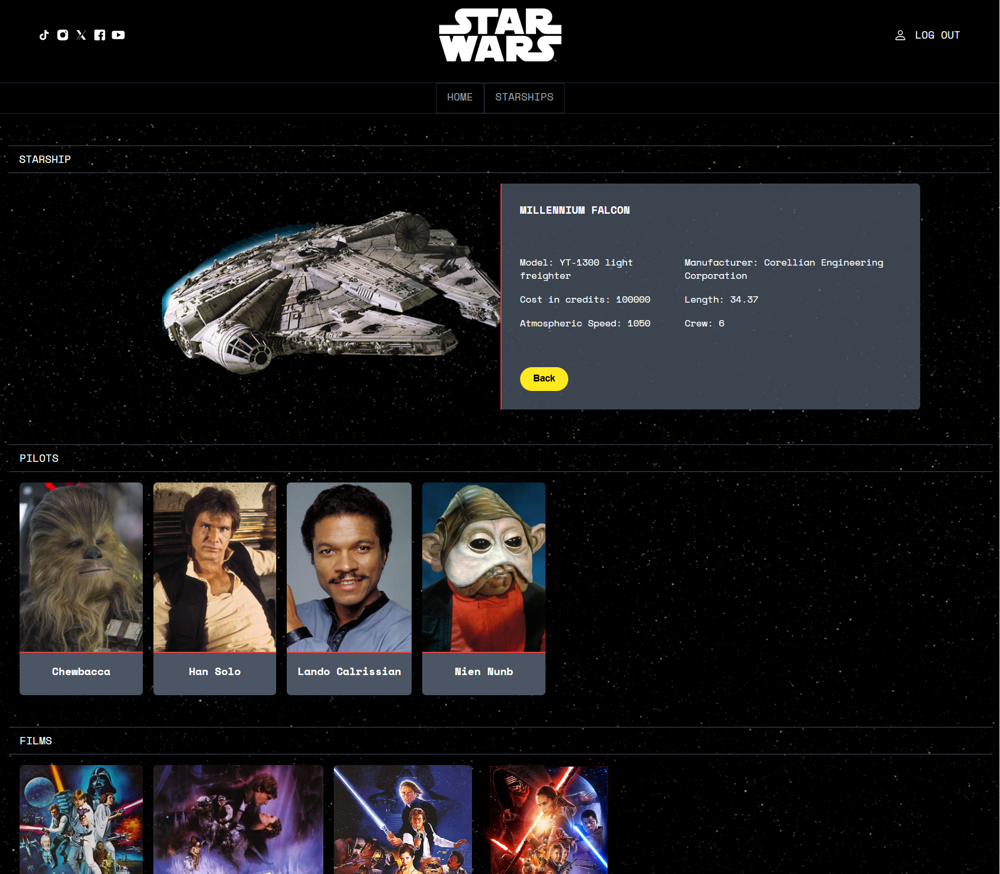

# React Context API Example

## 📄 Description

Welcome! This is a simple Star Wars Wikia built with React + Vite. The app includes state management using Context API, user authentication with Firebase and components made with Storybook. The page is based on the official Star Wars site. Hope you like it.



## 💻 Technologies Used

- React
- Vite
- Typescript
- Firebase
- Storybook 
- Tailwind CSS
- React Router
- Vitest

## 💡 Functionalities

- [x] Reusable components
- [x] Context API for state management
- [x] Pages
- [x] URL parameters
- [x] Client info form
- [x] Routes and pages
- [x] User authentication
- [ ] Unit testing

## 📋 Requirements

- Node.js and npm installed on your system. You can download them from [nodejs.org](https://nodejs.org/).

## 🚀 Installation

**✔️ Step 1:** Clone the repository to your local machine (replace `your-username` with your GitHub username):

```bash
git clone https://github.com/your-username/react-context-api-example.git
cd react-context-api-example
```

**✔️ Step 2:** Install the required dependencies:

```bash
npm install
```

**✔️ Step 3:** Start the development server using Vite:

```bash
npm run dev
```
Once the server is running, you'll see a URL similar to:

```bash
 > Local: http://localhost:5173/
```

**✔️ Step 4:** Run storybook:

```bash
npm run storybook
```

**✔️ Step 5:** For storybook to run properly with TailwindCss, run this:

```bash
npm run watch:css
```

## 🤝 Contributions
If you want to contribute or report issues, feel free to create an issue or submit a pull request.
